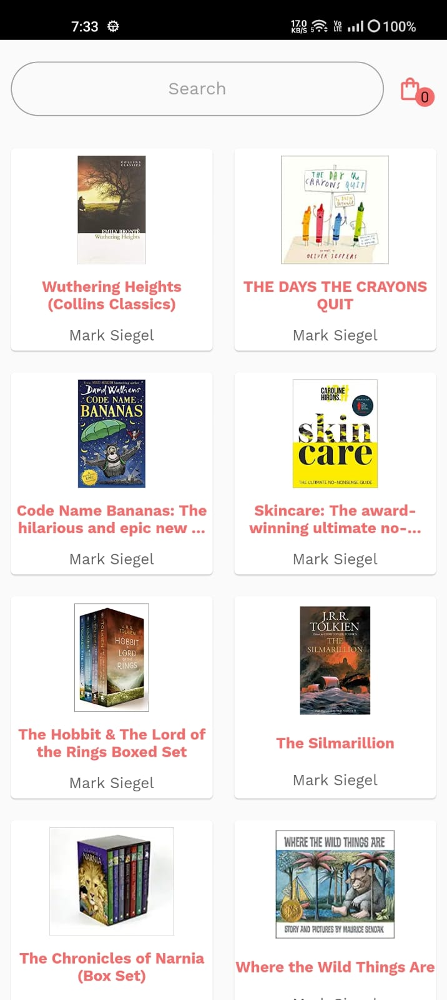
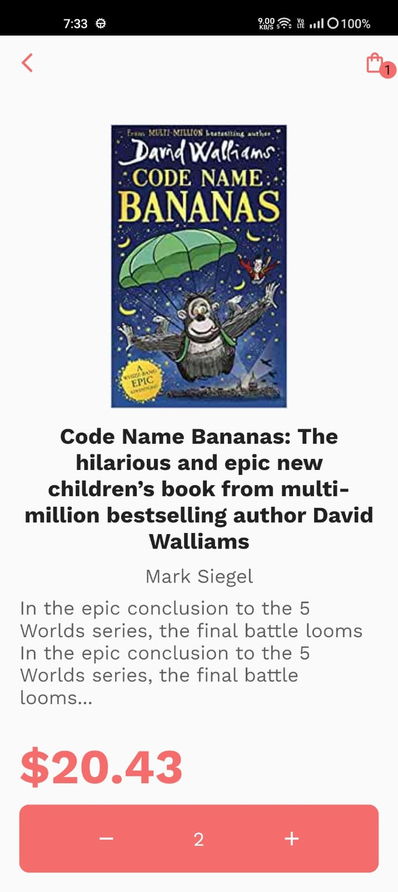
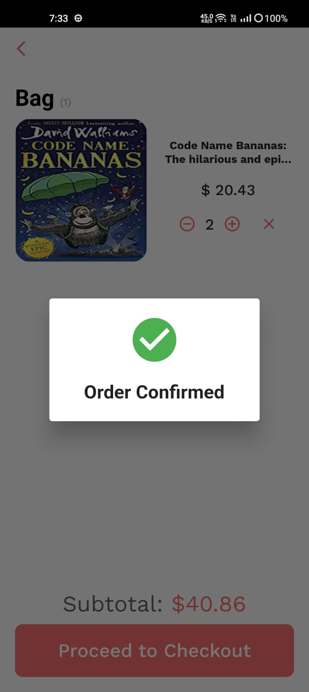

# book_shop_app

### Shop for your favourite books on this app

 

## Screenshots

 

## How to run?

- Run `flutter pub get` in the root folder
- run `flutter run` to run the app.

## Features

- [x] Add books to cart
- [x] Preserve the cart data so that when app is reopened, the previous data is present
- [x] Search for a book
